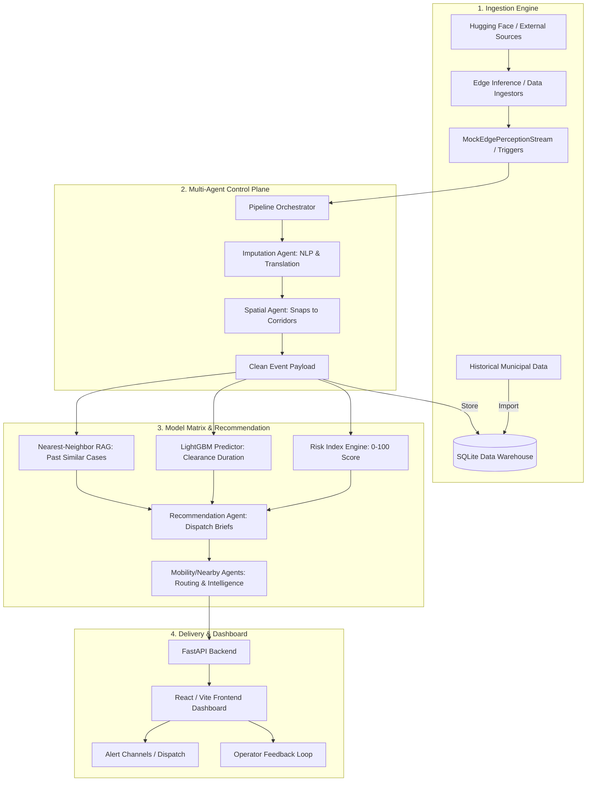

# 🚦 Cognitive Traffic Orchestrator

**🌐 Live Demo: [https://cognitive-traffic-orchestrator.vercel.app/](https://cognitive-traffic-orchestrator.vercel.app/)**

A scalable AI pipeline and interactive dashboard designed to solve unplanned traffic gridlocks in Bengaluru. The system integrates real-time CCTV edge processing, a Multi-Agent Control Plane for data processing, and predictive models, all visualized on a sleek React-based dashboard.


This project is divided into two main components:
1. **Backend (Python)**: The core AI engine handling data ingestion, agentic orchestration, and predictive modeling, exposed via a FastAPI layer.
2. **Frontend (React/Vite)**: A dynamic, interactive user interface that consumes the backend API to display live and historical traffic insights, dispatch recommendations, and system health.

---

## 🏗️ System Architecture Overview

The Cognitive Traffic Orchestrator relies on a modern decoupled architecture where multiple AI agents work together to process traffic events, generate risk models, and provide actionable recommendations.



### The 4 Core Loops of the System:
1. **Event-Driven Loop**: The system listens to live data (simulated edge cameras) to trigger the pipeline asynchronously.
2. **Core Agent Loop**: The Orchestrator manages the flow of raw data. First, the **Imputation Agent** translates regional text (Kannada to English) and fills gaps. Then, the **Spatial Agent** resolves messy coordinates into 22 recognized Bengaluru traffic corridors.
3. **Verification & Recommendation Loop**: Clean data flows into a Spatio-Temporal Risk Engine, a LightGBM Machine Learning model for duration prediction, and a RAG (Retrieval-Augmented Generation) system for finding analogous past incidents. The results are merged into an actionable brief.
4. **Hill-Climbing Loop**: Human operators review the suggested dispatch briefs on the dashboard, modify them if needed, and log feedback to continuously improve the RAG weights.

---

## 📂 Codebase Structure

The workspace is neatly divided into the backend orchestrator and the frontend dashboard.

```text
Root/
├── cognitive-traffic-orchestrator/    # Python Backend & AI Engine
│   ├── data/                          # SQLite warehouse & raw datasets
│   ├── src/
│   │   ├── app/
│   │   │   ├── main.py                # Streamlit Dashboard (Ops console alternative)
│   │   │   ├── api.py                 # FastAPI JSON backend for the React app
│   │   │   └── alert_channel.py       # Webhook & Push notification handler
│   │   ├── agents/                    # The AI Brains (Loop 1)
│   │   │   ├── core_orchestrator.py   # Manages the agent workflow pipeline
│   │   │   ├── imputation_agent.py    # Language translation and missing data fixer
│   │   │   ├── spatial_agent.py       # Maps raw lat/lon to road corridors
│   │   │   ├── recommendation_agent.py# Combines models into a dispatch brief
│   │   │   └── mobility_agent.py      # Plans routes avoiding risks
│   │   ├── models/                    # The Machine Learning Matrix
│   │   │   ├── risk_index.py          # Calculates spatio-temporal risk (0-100)
│   │   │   ├── predictor.py           # LightGBM regressor for incident duration
│   │   │   └── analogue_recommender.py# Nearest-neighbor RAG for historical matching
│   │   ├── ingestion/                 # API connectors (Mappls, OSM, Traffic data)
│   │   └── edge/                      # Simulates Edge CCTV anomaly detections
│   └── requirements.txt               # Backend Python dependencies
│
└── frontend/                          # React / Vite Dashboard
    ├── src/                           # UI Components, Pages, and API hooks
    ├── package.json                   # Node dependencies
    └── vite.config.ts                 # Build configuration
```

---

## 🚀 How to Run the Project

Running this system involves starting the backend API server, and then starting the frontend web application.

### Step 1: Start the Backend (FastAPI + AI Models)

The backend exposes the AI pipeline and database to the frontend via a REST API. It must be running for the dashboard to display any data.

1. **Open a terminal (PowerShell recommended for Windows)** and navigate to the backend folder:
   ```powershell
   cd cognitive-traffic-orchestrator
   ```

2. **Create and Activate a Virtual Environment**:
   ```powershell
   python -m venv .venv
   .\.venv\Scripts\Activate.ps1
   ```
   *(If you get a script execution error on Windows, run `Set-ExecutionPolicy -ExecutionPolicy Bypass -Scope Process` first).*

3. **Install Dependencies**:
   ```powershell
   pip install -r requirements.txt
   ```

4. **Run the FastAPI Server**:
   ```powershell
   uvicorn src.app.api:app --reload --port 8000
   ```
   *The backend will automatically ingest the dataset and train the LightGBM model on startup. You should see it running on `http://localhost:8000`.*
   *You can verify the backend health by visiting `http://localhost:8000/api/health` in your browser.*

*(Optional)* If you want to use the legacy Streamlit internal ops console instead of the React app, you can run `streamlit run src/app/main.py`.

### Step 2: Start the Frontend (React Dashboard)

With the backend running in its own terminal, open a **new terminal** to start the frontend.

1. **Navigate to the frontend directory**:
   ```powershell
   cd frontend
   ```

2. **Install Node Modules**:
   ```powershell
   npm install
   ```

3. **Configure Environment Variables**:
   ```powershell
   copy .env.example .env
   ```
   *The default `.env` will look for the backend at `http://localhost:8000`, which matches the backend setup.*

4. **Start the Development Server**:
   ```powershell
   npm run dev
   ```

5. **Open the Dashboard**: The terminal will print a local URL (usually `http://localhost:5173`). Open this URL in your web browser.

---

## 🎯 Verifying the System is Working

Once both servers are running, open your web browser to the frontend dashboard URL (`http://localhost:5173`):

1. **Overview Tab**: You should see live KPIs and charts populated by thousands of historical rows, rather than blank states or zeros.
2. **Event Feed Tab**: Click **"Trigger mock event"**. This simulates an Edge camera detecting a breakdown. A new card will pop up showing the nearest corridor, calculated in real-time.
3. **Model Matrix Tab**: Check this tab to see the AI pipeline's output for the mock event, including the Risk Score (0-100), Predicted Clear Duration, and an automated Dispatch Brief powered by RAG and LightGBM.
4. **Dispatch Tab**: On the Model Matrix, click "Deploy Field Alert". Move to the Dispatch tab to see the alert successfully logged into the action system.

Enjoy exploring the Cognitive Traffic Orchestrator!
