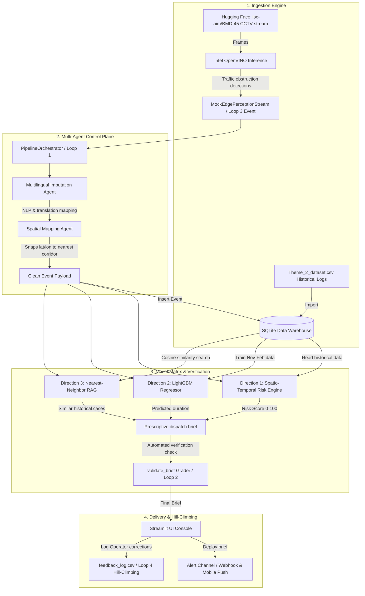

# 🚦 Cognitive Traffic Orchestrator

A scalable AI pipeline designed to solve unplanned traffic gridlocks in Bengaluru. The system integrates real-time CCTV edge processing using **Intel OpenVINO** and **Hugging Face (`iisc-aim/BMD-45`)**, a **Multi-Agent Control Plane** for multilingual translation and geospatial resolution, and **predictive/prescriptive models** built on a local **SQLite Data Warehouse**.

---

## 🏗️ System Architecture Diagram



---

## 🔄 Core Loop Engineering Principles

The codebase implements LangChain's Loop Engineering principles across four cycles:
1.  **Core Agent Loop (Loop 1):** Ingests chaotic event details, applies regex translation mapping (resolving regional Kannada terms), and resolves missing fields. Snaps coordinates to the nearest of the 22 known corridors.
2.  **Verification Loop (Loop 2):** Runs deterministic validation rules on generated recommendations (e.g., if road closure is mandated, it ensures barricades are marked active). Overrides recommendations when verification rules fail.
3.  **Event-Driven Loop (Loop 3):** Simulates Edge-IoT CCTV frames detecting road anomalies (breakdowns, congestion) and pushing clean triggers to the controller asynchronously.
4.  **Hill-Climbing Loop (Loop 4):** Records operator actions and corrections, exporting them to `feedback_log.csv` for continuous system weight refinement.

---

## 📂 Codebase Directory Structure

```text
cognitive-traffic-orchestrator/
├── data/
│   ├── Theme_2_dataset.csv             # Historical municipal database (Nov-Apr)
│   └── traffic_orchestrator.db         # Initialized SQLite database warehouse
├── PROMPTS/
│   ├── 01_phase1_ingestion.md
│   ├── 02_phase2_agents.md
│   ├── 03_phase3_models.md
│   └── 04_phase4_delivery.md
├── src/
│   ├── edge/
│   │   ├── __init__.py
│   │   └── openvino_inference.py       # Streams HF dataset, runs OpenVINO detections
│   ├── agents/
│   │   ├── __init__.py
│   │   ├── core_orchestrator.py        # Pipeline orchestrator controller
│   │   ├── imputation_agent.py         # Imputes regional text & missing causes
│   │   └── spatial_agent.py            # Snipe snaps coordinates to 22 road corridors
│   ├── models/
│   │   ├── __init__.py
│   │   ├── db.py                       # Local SQLite database warehouse connector
│   │   ├── risk_index.py               # Spatio-temporal risk index aggregator
│   │   ├── predictor.py                # LightGBM model predicting clearing duration
│   │   └── analogue_recommender.py     # Nearest-Neighbor RAG & validation grader
│   └── app/
│       ├── main.py                     # Streamlit Console Dashboard Hub
│       ├── api.py                      # FastAPI JSON layer for the React dashboard
│       └── alert_channel.py            # SMS/Mobile push webhook notifier
├── requirements.txt                    # App package dependencies
└── README.md                           # Documentation

../../frontend/                         # React/Vite dashboard, see frontend/README.md
```

---

## 🛠️ Setup Instructions (Windows PowerShell)

Follow these steps to create your virtual environment and install the required modules.

### 1. Initialize & Activate Virtual Environment
Delete any previous Linux-style virtual environments if present, then build and activate a Windows native environment:
```powershell
# Remove old venv if necessary
Remove-Item -Recurse -Force .venv

# Create Windows venv
python -m venv .venv

# Activate venv
.\.venv\Scripts\Activate.ps1
```
*(If you get a script execution policy error, run: `Set-ExecutionPolicy -ExecutionPolicy Bypass -Scope Process` first)*

### 2. Install Project Dependencies
```powershell
pip install -r requirements.txt
```

---

## 🚀 Running the Orchestrator

Ensure you are inside the `cognitive-traffic-orchestrator` folder.

### Run the Ingestion Stream In Isolation
To test the Hugging Face CCTV streaming and OpenVINO detection in isolation:
```powershell
python src/edge/openvino_inference.py
```
*Note: To stream gated datasets or bypass public query thresholds, you can set the `HF_TOKEN` environment variable.*

### Run the Streamlit Management Console
Run the original internal/ops dashboard:
```powershell
streamlit run src/app/main.py
```

### Run the FastAPI Backend (for the React dashboard)
Exposes the same orchestrator/risk/predictor/RAG pipeline as JSON over HTTP. Still from inside this `cognitive-traffic-orchestrator` folder:
```powershell
uvicorn src.app.api:app --reload --port 8000
```
See `../../frontend/README.md` for running the React dashboard against this API.

---

## ⚙️ Module Execution Flow Details

1.  **Database Migration (On Startup)**: The app reads `Theme_2_dataset.csv` and loads it into the `events` table of the SQLite database.
2.  **LightGBM Training**: The `predictor.py` script automatically trains the regressor on the SQLite data strictly utilizing months **Nov-Feb**, then saves the model to `duration_predictor.pkl`.
3.  **Live Event Processing**: 
    - Event is triggered from the CCTV stream.
    - Imputation agent maps local text (e.g. `ಮಳೆ` -> `waterlogging`).
    - Spatial agent maps coordinates to the closest corridor.
    - The cleaned payload is saved in the database.
4.  **Risk & Prediction Output**: Risk Index computes spatio-temporal congestion levels from historical entries, LightGBM predicts clearing windows, and RAG outputs prescriptive dispatch actions.
5.  **Alerting & Logging**: Operator can dispatch alerts (webhooks) and record adjustments to `feedback_log.csv`.
